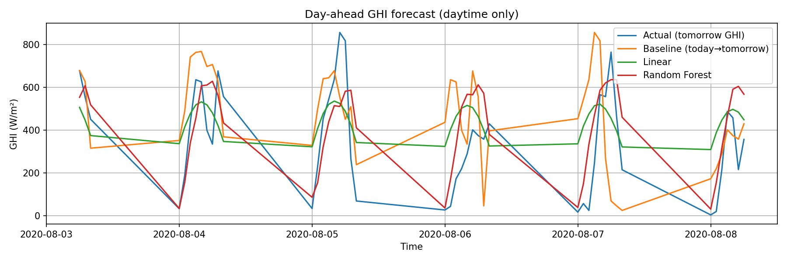
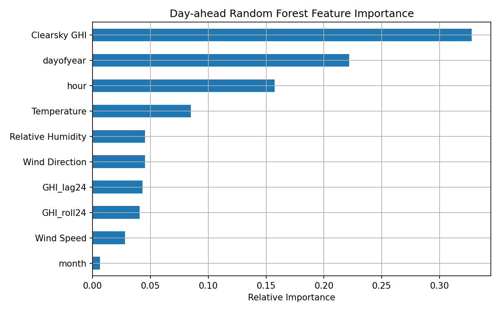
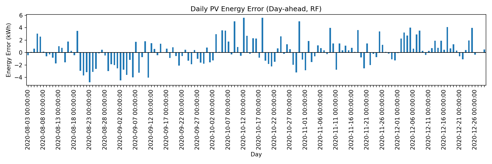

# solar-power-forecasting

# Day-Ahead Solar Power Forecasting (NSRDB – Manila)

This repository contains a **day-ahead solar irradiance forecasting project** using hourly data from the **National Solar Radiation Database (NSRDB)**. The goal is to predict **Global Horizontal Irradiance (GHI) 24 hours in advance** and evaluate forecast skill relative to a physically meaningful persistence baseline. Forecasted irradiance is further translated into estimated photovoltaic (PV) power and daily energy yield to demonstrate operational relevance.

---

## Project Overview

- **Forecast horizon:** 24 hours (day-ahead)
- **Target variable:** Global Horizontal Irradiance (GHI)
- **Location:** Metropolitan Manila, Philippines
- **Data source:** National Solar Radiation Database (NSRDB)
- **Models used:**  
  - Persistence baseline  
  - Linear Regression  
  - Random Forest Regression

This project emphasizes **physical consistency, leakage-free modeling, and realistic evaluation**, rather than unrealistically low errors often produced by short-term persistence.

---

## Dataset

Hourly solar and meteorological data were downloaded from the **NSRDB Viewer**:

- Temporal resolution: 60 minutes  
- Years used: 2019–2020  
- Variables include:
  - GHI and clear-sky GHI
  - Air temperature
  - Relative humidity
  - Wind speed and direction
  - Calendar information (hour, day of year, month)

NSRDB CSV files include metadata and unit definitions in the first rows; these were explicitly removed, and numeric columns were manually cast to ensure correct data types.

Reference:
- https://nsrdb.nrel.gov/nsrdb-viewer

---

## Methodology

### Day-Ahead Forecasting Setup
The task was formulated as:

**Forecast objective:** predict **GHI at (t + 24 hours)** using only information available at time **t**.

This removes short-term persistence effects and forces the model to generalize across days.

### Feature Engineering
Predictors include:
- Calendar features (hour, day of year, month)
- Meteorological variables (temperature, humidity, wind)
- Clear-sky GHI (solar geometry reference)
- Historical persistence at daily scale:
  - GHI lag-24
  - 24-hour rolling mean of GHI

Short-term lags (e.g., lag-1) and contemporaneous radiation components were excluded to avoid information leakage.

### Train/Test Split
A chronological 80/20 split was applied:
- First 80% → training
- Last 20% → testing

No shuffling was used.

### Baseline
A persistence baseline was defined as:

**Persistence baseline:** ŷ(t) = GHI(t)  
(i.e., tomorrow’s irradiance ≈ today’s irradiance at the same hour)

i.e., tomorrow’s irradiance is assumed equal to today’s irradiance at the same hour.

---

## Results (Day-Ahead)

| Model | RMSE (W/m²) | Skill vs Baseline |
|------|------------:|------------------:|
| Persistence baseline | 271.52 | — |
| Linear regression | 218.07 | ~19.7% |
| Random Forest | 177.21 | ~34.7% |

Random Forest achieved the best performance by capturing nonlinear interactions between solar geometry, meteorology, and historical persistence. Residual errors remain substantial due to the intrinsic unpredictability of cloud evolution at day-ahead horizons.

---

## From Irradiance to PV Energy

Forecasted GHI was converted into PV power using a simplified fixed-efficiency model:

**PV power model (simplified):** P(t) = η × A × GHI(t)  
where η is PV efficiency and A is panel area.

where:
- η is assumed PV efficiency
- A is panel area

Hourly power was aggregated into daily energy (kWh) to evaluate forecast impact at an energy-relevant timescale.

---

## Key Figures

---

## Repository Structure

Repository Structure

├── README.md
├── 01_solar_power_forecasting_DAYAHEAD_CLEAN.ipynb
├── figures/
│   ├── ghi_day_ahead_forecast.png
│   ├── rf_feature_importance_day_ahead.png
│   ├── pv_power_day_ahead.png
│   └── pv_daily_energy_error.png
└── docs/
    ├── index.md
    ├── solar_notebook.html
    └── figures/

---

## Notes and Limitations

- Forecasts are based on GHI, not measured PV output.
- PV conversion is simplified and does not include temperature effects, tilt, or inverter losses.
- Day-ahead skill is fundamentally limited by cloud variability; incorporating satellite imagery or NWP forecasts would likely improve performance.

---

## References
- National Renewable Energy Laboratory (NREL). **National Solar Radiation Database (NSRDB)**  
  https://nsrdb.nrel.gov/

- Perez, R., et al. (2013). *Validation of the National Solar Radiation Database (NSRDB).*  
  Solar Energy, 93, 121–132.

- Lorenz, E., et al. (2014). *Regional photovoltaic power prediction for improved grid integration.*  
  IEEE Journal of Selected Topics in Applied Earth Observations and Remote Sensing.

- Yang, D., et al. (2015). *Solar irradiance forecasting using time-series and machine learning methods.*  
  Renewable and Sustainable Energy Reviews, 44, 676–686.

- SolarAnywhere. *Solar Irradiance Data Field Definitions*.  
  Clean Power Research.  
  https://www.solaranywhere.com/support/data-fields/definitions/
