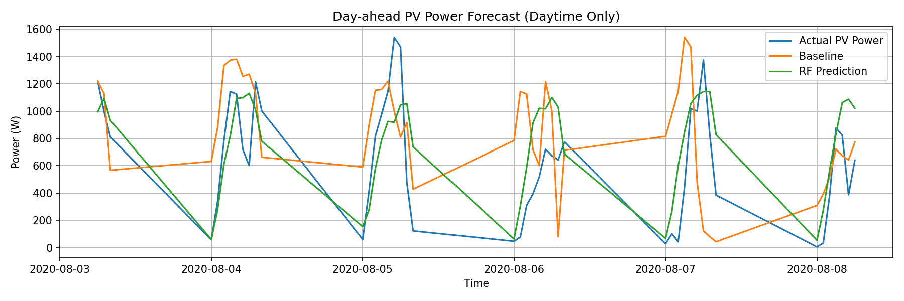

## Full Notebook

👉 [Open the full analysis notebook](solar_notebook.html)
---

## Figures

### Day-Ahead GHI Forecast (Random Forest)

### Random Forest Feature Importance

### Day-Ahead PV Power Forecast

### Daily PV Energy Error (Day-Ahead)

